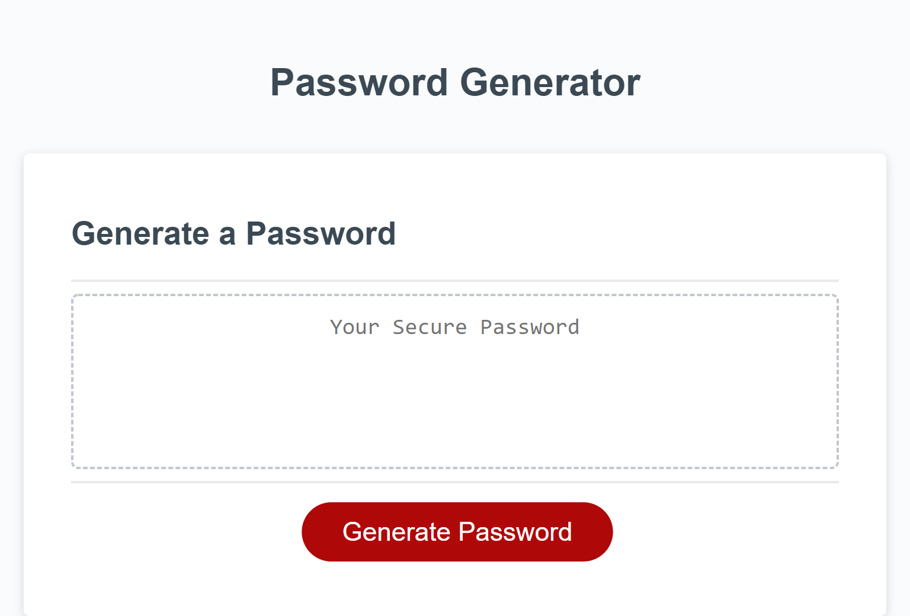

# Project 3 - Random Password Generator
In this project I created a JavaScript file that prompts a user for specific criteria and generates a random password that meets those criteria. The application neede to meet the following acceptance criteria:
* When the "Generate Password" button is clicked, the user is presented with a series of prompts about the password character criteria
* When the password length is entered, only integer values between 8 and 128 will be accepted
* The user will be prompted to included or exclude lowercase letters, uppercase letters, numbers, and special symbols
* Each user selection will be validated for syntax
* At least one of each selected character type must be included in the generated password
* The password must be displayed to the user once it is generated

## Where to Find It
The application is deployed [here](https://pikaypi.github.io/random-password-generator/).

## What It Looks Like

## How It Works
When the user clicks the "Generate Password" button, they are prompted to select a password length. If the value provided by the user is not an integer between 8 and 128, an error alert will appear telling the user why their input was invalid. If the password length is valid, the user will then receive a prompt to confirm inclusion of each of the four sets of characters - lowercase letters, uppercase letters, numbers, and special symbols. Once the final prompt has been answered, the generated password appears in the text box.
